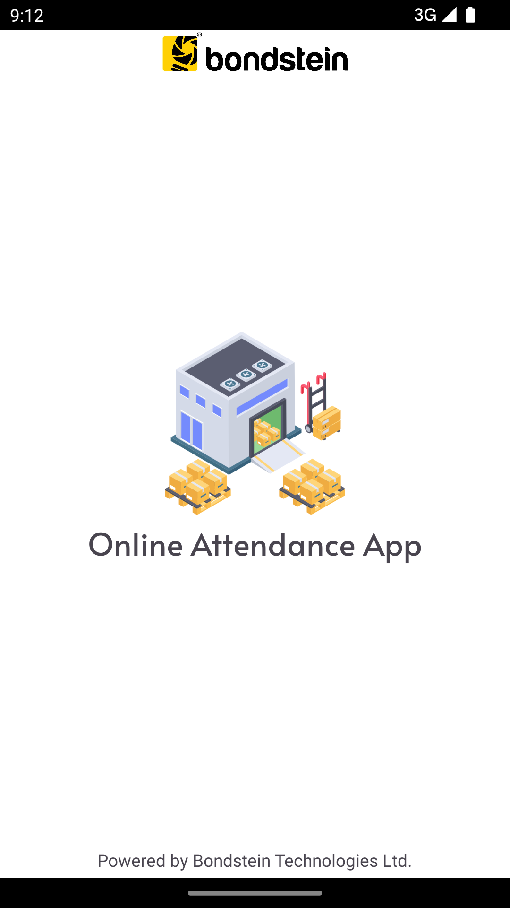
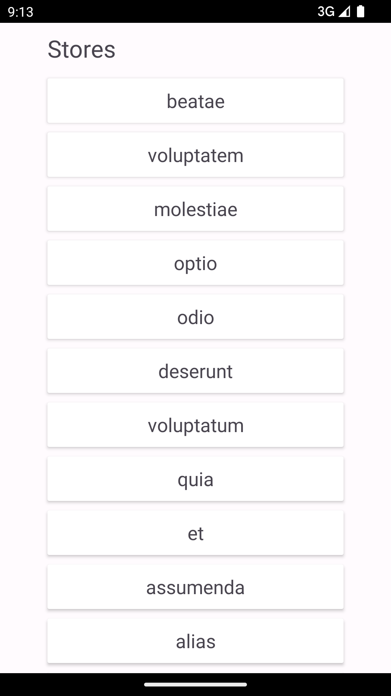
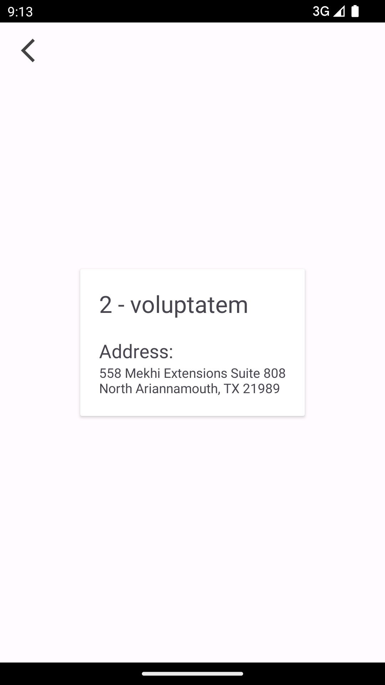
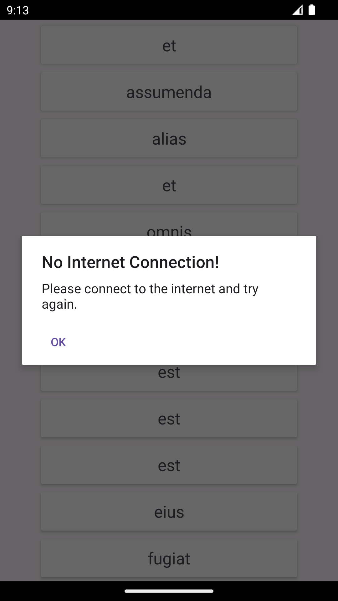

# Online-Attendance-App

<a href="https://www.flaticon.com/free-icons/attendance" title="attendance icons">Application icon by Flat Icons</a>

## Overview
The **Online Attendance App** is a very simple information viewer app that does a very simple task of fetching data from an API and viewing it on the UI. It makes use of some of the latest and most popular libraries that are commonly used in the industry by most devs out there.

### Key Features
- Fetches data from http://128.199.215.102:4040
- Uses ```android:usesCleartextTraffic="true"``` inside the application tag in Manifest file for the http request
- Caches the data
- Updates UI by fetching data from a ViewModel that in turn receives it from a Repository
- Implements dependency injection
- Uses manual paging
- Navigates with navigation component

### Tech stack
- [Kotlin](https://kotlinlang.org/)
- [Coroutines](https://github.com/Kotlin/kotlinx.coroutines)
- [Flow](https://kotlin.github.io/kotlinx.coroutines/kotlinx-coroutines-core/kotlinx.coroutines.flow/) - Flow sends a stream of data that can be computed asynchronously.
- [Dagger-Hilt](https://developer.android.com/training/dependency-injection/hilt-android)
- [LiveData](https://developer.android.com/topic/libraries/architecture/livedata)
- [Lifecycle](https://developer.android.com/jetpack/androidx/releases/lifecycle) - Provides lifecyle event of an activity or fragment.
- [ViewModel](https://developer.android.com/topic/libraries/architecture/viewmodel) - Stores UI-related data that isn't destroyed on UI changes.
- [Navigation](https://developer.android.com/guide/navigation/navigation-getting-started)
- [Data Binding](https://developer.android.com/topic/libraries/data-binding)
- [Retrofit](https://github.com/square/retrofit) - Provides REST api communication.
- [OkHttp](http://square.github.io/okhttp/)
- [Gson](https://github.com/google/gson) - Converts Java Objects to JSON and vice versa.

## Screenshots
 
 

## Getting Started
These instructions will help you set up and run the project on your local machine for development and testing purposes.

### Prerequisites
- [Android Studio](https://developer.android.com/studio)
- Required [libraries](https://developer.android.com/studio/install#64bit-libs) for 64-bit Linux machines
- Android SDK
- Java 17

### Installation
1. Clone the repository by pasting the following command into your terminal:
```bash
   git clone git@github.com:sadman1148/Online-Attendance-App.git
```
2. Open the project in Android Studio and let it sync.
3. Connect a physical device or build a virtual device with the AVD manager.
4. Run the app.

### Usage
1. Browse the stores list, it will load the next page's stores and add them to the list when scrolled to the bottom.
2. Tap on any store name to see details about that store.


## Contribution
I welcome contributions from the community. To contribute to this project, follow these steps:

1. Fork this repository.
2. Create a new branch for your feature or bug fix: git checkout -b feature/your-feature-name
3. Make your changes and commit them: git commit -m 'Added a new feature'
4. Push to your branch: git push origin feature/your-feature-name
5. Create a pull request on this repository.


## Contact
Feel free to contact me on my [LinkedIn](https://www.linkedin.com/in/sadman-alam-impulse/) profile.
